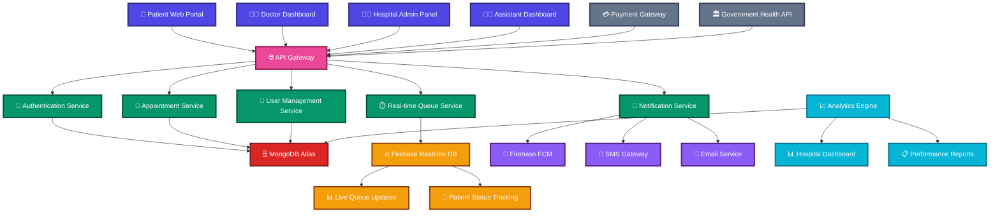

<h1 align="center">🏥 HealthCare Platform</h1>


## *Revolutionizing Healthcare in India* 
  
### 🚀 Eliminating Long Queues with Smart Digital Solutions

<div align="center">

[](https://github.com/team27)
[](https://github.com/team27/hms)
[](https://github.com/team27/hms)
[](#license)

</div>

---


<div align="center">

### 🌟 **Transforming Healthcare Experience**
*Building the future of medical management with cutting-edge technology*

</div>

<br>

<div align="center">

</div>

---


## 📋 **Table of Contents**

- [🎯 Problem Statement](#-problem-statement)
- [💡 Solution Overview](#-solution-overview)
- [🏗️ System Architecture](#️-system-architecture)
- [🔌 API Routes & Endpoints](#-api-routes--endpoints)
- [📱 Technology Stack](#-technology-stack)
- [📂 Project Structure](#-project-structure)
- [🔔 Real-time Features & Notification](#-real-time-features)
- [📊 Impact & Analytics](#-impact--analytics)

---

## 🎯 **Problem Statement**


### **Current Healthcare Crisis in India**

India's healthcare system faces critical challenges that directly impact patient lives:

#### 📈 **Alarming Statistics**
- **1.6 million Indians** died in 2016 due to poor quality care and management *(The Lancet)*
- **75% of cancer deaths** at AIIMS Delhi are attributed to long waiting times
- **10,000+ OPD patients** daily at AIIMS with many turned away

#### 🚨 **Critical Issues**

| Issue | Impact | Consequence |
|-------|--------|-------------|
| **Excessive Queuing** | 3-8 hours wait time | Patient mortality, delayed treatment |
| **Disease Spread** | Crowded waiting areas | TB, COVID-19, Influenza transmission |
| **Staff Overload** | Unmanaged crowds | Reduced care quality |
| **Manual Processes** | Paper-based systems | Appointment conflicts, confusion |

#### 📰 **Real Cases**
- Mumbai Hospital Staff Dies After 3-Hour Wait
- Man Dies Waiting for Ultrasound at Noida Hospital
- COVID Patient Dies Outside Thane Hospital Waiting for ICU
- Patient Dies After 3-Hour Queue Wait in Kolkata

---

## 💡 **Solution Overview**

### 🩺 **For Doctors**
```
✅ Real-time appointment dashboard
✅ Smart patient flow management
✅ Automated arrival notifications
✅ Queue status updates
✅ One-click patient communication
```

### 🏥 **For Patients**
```
✅ Online appointment booking
✅ Real-time queue tracking (like Uber/Ola)
✅ SMS & push notifications
✅ Estimated wait times
✅ Just-in-time arrival alerts
✅ Reduced exposure to crowds
```

### 👨‍💼 **For Hospital Staff**
```
✅ Centralized patient management
✅ Digital workflow automation
✅ Real-time analytics
✅ Staff coordination tools
✅ Resource optimization
```

---

## 🏗️ **System Architecture**



---


## 🔔 **Real-time Features & Notification**

### **Firebase Cloud Messaging (FCM) Events**

| Event Type | Trigger | Recipients | Message Template |
|------------|---------|------------|------------------|
| **Doctor Arrival** | Assistant check-in | Waiting patients | "🩺 Dr. {name} has arrived. Your estimated wait: {time} mins" |
| **You're Next** | Queue management | Next patient | "🔔 You're next! Please proceed to Room {number}" |
| **Appointment Reminder** | 30 mins before | Patient | "⏰ Reminder: Appointment with Dr. {name} at {time}" |
| **Queue Update** | Real-time | All waiting | "📊 Queue Update: {position} people ahead of you" |
| **Delay Notification** | Doctor/Staff | Affected patients | "⏳ Delay Alert: Dr. {name} is running {mins} minutes late" |
| **Report Ready** | Lab upload | Patient | "📋 Your test results are ready for download" |
| **Prescription** | Doctor | Patient | "💊 New prescription available from Dr. {name}" |


## 📊 **Impact & Analytics**

### **Expected Outcomes**

| Metric | Current State | Target Improvement |
|--------|---------------|-------------------|
| **Average Wait Time** | 3-8 hours | 15-30 minutes |
| **Patient Satisfaction** | 40% | 85%+ |
| **Doctor Efficiency** | 60% | 90%+ |
| **Disease Transmission Risk** | High | 70% reduction |
| **Administrative Cost** | 100% | 40% reduction |
| **No-show Rate** | 30% | 10% |


<div align="center">

**🏥 Building a Healthier Tomorrow, One Queue at a Time 🏥**

*Made with ❤️ by HomoSapiens*

</div>
